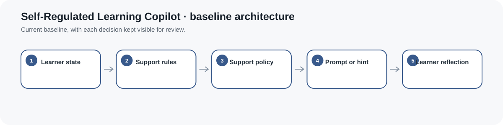
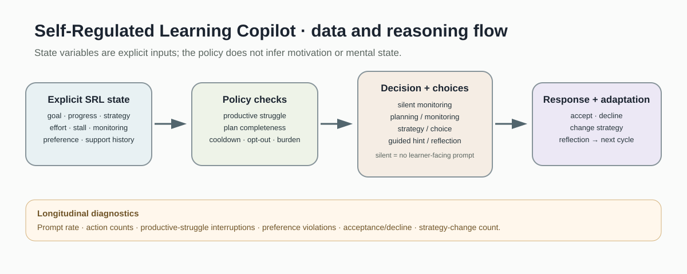
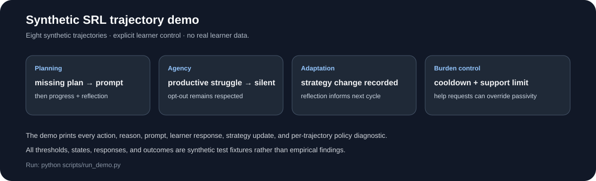
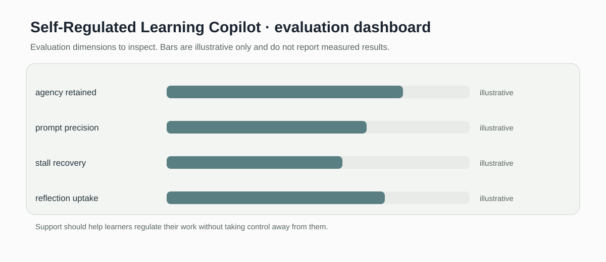

# Self-Regulated Learning Copilot

> Transparent, agency-preserving support policy for goals, planning, monitoring, strategy adaptation, learner-requested help, reflection, and prompt-burden control.

[](https://github.com/devissaputra/self_regulated_learning_copilot/actions/workflows/ci.yml)



**Area:** AI in Education · Self-Regulated Learning · Adaptive Scaffolding  
**Status:** working research prototype  
**Author:** Devis Wawan Saputra

## What this project is for

A self-regulated learning support system should not become an autopilot.

Learners need opportunities to:

- define goals
- make plans
- choose strategies
- monitor progress
- experience productive struggle
- request help
- decline help
- reflect on what worked
- adapt their next learning cycle

This repository provides a transparent rule-policy laboratory for studying those decisions.

The current implementation does **not** infer self-regulation, motivation, emotion, or mental state from raw learner behavior.

It receives an explicit state and decides whether support should be offered—or whether the best action is to leave the learner alone.

## The SRL cycle



The design is informed by cyclical self-regulated learning models in which learners repeatedly move through task understanding, goals/plans, strategy use, monitoring, and adaptation.

The implementation is deliberately smaller than a complete psychological model.

It operationalizes a transparent support-policy layer that can be inspected and tested independently.

## Explicit learner state

`SRLState` contains several groups of evidence.

### Learning evidence

- mastery
- confidence
- effort
- stalled time
- recent progress

### Forethought and planning

- goal
- goal progress
- next action
- success evidence

### Strategy use and monitoring

- current strategy
- previous strategy
- strategy effectiveness
- strategy-change count
- monitoring accuracy

### Learner control

- explicit help request
- support preference
- minutes since last support
- support count
- reflection due

### Task context

- task difficulty
- time pressure

These values are **supplied inputs**.

The package does not currently estimate them from clickstreams, text, multimodal traces, or an AI model.

## Planning is explicit

The original prototype inferred a planning problem from low effort and low mastery.

That assumption has been removed.

`plan_completeness()` now checks whether an explicit plan contains:

- a goal
- a next action
- evidence that would indicate progress
- a current strategy

A missing structure can trigger a planning prompt when progress is also limited.

This structural indicator still does not prove that a plan is educationally good.

## Productive struggle

Difficulty should not automatically cause intervention.

`classify_struggle()` distinguishes:

- `not_stalled`
- `productive`
- `ambiguous`
- `unproductive`

The operational productive-struggle rule uses:

- effort
- recent progress
- strategy effectiveness
- stalled time

When struggle appears productive, the policy performs **silent monitoring** rather than interrupting the learner.

That classifier is a transparent hypothesis for research, not an empirically validated psychological diagnosis.

## Real silent monitoring

The original prototype returned `monitor` and then still displayed a learner-facing prompt.

That contradiction is fixed.

The current action:

```text
silent_monitor
```

returns:

```text
prompt = None
interrupt = False
```

Sometimes the correct support action is no intervention.

## Support actions

`decide_support()` can select:

- `silent_monitor`
- `planning_prompt`
- `monitoring_prompt`
- `strategy_prompt`
- `choice_prompt`
- `guided_hint`
- `reflection_prompt`

Each decision includes:

- action
- reason
- whether it interrupts
- support intensity
- learner choices

## Learner choice before stronger help

Potentially unproductive persistence does not automatically force a hint.

The default unsolicited response is a choice:

```text
continue without help
strategy check
guided hint
```

A stronger guided hint is provided directly when the learner explicitly requests help during a significant stall.

## Support preference

Supported preferences are:

- `normal`
- `minimal`
- `off`

When support is off, unsolicited prompts are suppressed.

An explicit learner request for help can override that passive preference because the learner is actively asking for assistance.

## Prompt burden and cooldown

The policy includes configurable:

- support cooldown
- maximum support count
- stall thresholds
- progress thresholds
- monitoring thresholds
- strategy-effectiveness thresholds
- goal-completion threshold
- plan-completeness threshold

These are design assumptions.

They should be stress-tested rather than treated as universal constants.

## Reflection and adaptation

`ReflectionRecord` stores learner-supplied:

- strategy usefulness
- perceived goal progress
- confidence change
- what worked
- possible next strategy

`adaptation_from_reflection()` can then return transparent next-cycle suggestions such as:

- close the goal / set the next goal
- revise strategy
- review evidence and seek support
- continue or refine the strategy

The system does not infer why a learner responded in a particular way.

## Learner response and strategy history

`update_after_response()` can record observable interaction responses such as:

- accepted
- declined
- continued without help
- requested more help
- changed strategy
- completed reflection

A strategy change can preserve:

- previous strategy
- new strategy
- strategy-change count

These are interaction records, not judgments about motivation.

## Longitudinal diagnostics

`evaluate_policy_trace()` runs the support policy across a supplied state sequence.

It reports:

- total steps
- prompted steps
- silent steps
- prompt rate
- action counts
- productive-struggle interruptions
- learner-preference violations

`interaction_diagnostics()` can additionally summarize:

- learner-response counts
- decline fraction among prompts
- engaged-response fraction among prompts
- strategy-change count

These metrics inspect system behavior.

They do not establish that the support improved learning.

## Synthetic demo



The bundled dataset contains eight synthetic longitudinal scenarios:

1. incomplete planning followed by progress and reflection
2. productive struggle that should remain uninterrupted
3. unproductive persistence followed by learner-requested help and strategy change
4. opt-out followed by an explicit help request
5. cooldown and prompt-burden suppression
6. monitoring uncertainty
7. ineffective strategy followed by learner-selected strategy change
8. minimal support preference followed by goal reflection

All states, responses, and policy outcomes are synthetic.

They exist to exercise the policy logic.

## Run the project

```bash
git clone https://github.com/devissaputra/self_regulated_learning_copilot.git
cd self_regulated_learning_copilot

python scripts/run_demo.py
python -m unittest discover -s tests -v
```

The current implementation uses only the Python standard library.

## Data

`data/sample.csv` contains the synthetic longitudinal SRL trajectories.

`data/README.md` documents:

- state semantics
- learner-control fields
- strategy history
- reflection/adaptation fields
- trajectory scenarios
- state-estimation boundaries
- real-data governance requirements

## Core API

`SRLState`  
Explicit state supplied to the support policy.

`PolicyConfig`  
Inspectable policy thresholds.

`plan_completeness(...)`  
Checks structural presence of goal/plan elements.

`classify_struggle(...)`  
Distinguishes operational productive, unproductive, ambiguous, and non-stalled cases.

`decide_support(...)`  
Returns the conservative support decision and learner choices.

`render_support(...)`  
Maps a non-silent action to learner-facing copy. Silent monitoring returns `None`.

`update_after_response(...)`  
Records observable learner responses and strategy changes.

`ReflectionRecord`  
Stores learner-supplied end-of-cycle reflection.

`adaptation_from_reflection(...)`  
Returns a transparent next-cycle suggestion.

`evaluate_policy_trace(...)`  
Audits policy behavior across a longitudinal state sequence.

`interaction_diagnostics(...)`  
Summarizes observable response behavior.

`support_level(...)` and `reflection_prompt(...)`  
Backward-compatible helpers from the original prototype.

## Research grounding

The design is informed by established self-regulated learning research.

Panadero's review compares major SRL models, including Zimmerman and Winne & Hadwin:

- Panadero, E. (2017)
- *A Review of Self-regulated Learning: Six Models and Four Directions for Research*
- https://doi.org/10.3389/fpsyg.2017.00422

Work on personalized digital SRL scaffolding also emphasizes connecting SRL process evidence, support timing/content, learner response, and learning outcomes:

- van der Graaf et al. (2023)
- *How to design and evaluate personalized scaffolds for self-regulated learning*
- https://doi.org/10.1007/s11409-023-09361-y

See `docs/related_work.md`.

## Evaluation checklist



A real evaluation should separate:

1. **State validity** — do the state variables represent defensible SRL evidence?
2. **Trigger validity** — does intervention occur at useful moments?
3. **Support appropriateness** — is the selected support useful for that moment?
4. **Learner agency** — are opt-out, decline, minimal support, and help requests respected?
5. **Prompt burden** — are learners being interrupted too often?
6. **Longitudinal independence** — do learners become more capable of regulating without depending on prompts?

## Responsible-use boundary

This repository must not be described as detecting motivation or mental state.

Do not treat:

- low activity as low motivation
- long time-on-task as confusion
- low confidence as incapability
- strategy switching as failure
- prompt acceptance as proof of effectiveness

The current confidence variable is an explicit task-level input, not a clinical or personality construct.

## What the system intentionally does not do

The repository does not currently implement:

- raw log → SRL state inference
- multimodal SRL detection
- emotion recognition
- motivation inference
- psychological diagnosis
- reinforcement learning
- learned support policy
- LLM-generated prompts
- causal support-effect estimation
- production personalization

These boundaries are deliberate.

## Limitations

The current prototype:

- uses hand-authored thresholds
- depends on supplied state quality
- does not estimate state uncertainty
- uses a small support-action vocabulary
- does not validate thresholds empirically
- does not know the semantic content of the learning task
- does not estimate long-term support dependency
- does not prove that accepted prompts are beneficial
- does not replace empirical SRL measurement

## Repository map

```text
.
├── .github/workflows/ci.yml
├── assets/
│   ├── architecture.svg
│   ├── data_flow.svg
│   ├── demo_snapshot.svg
│   └── evaluation_dashboard.svg
├── data/
│   ├── README.md
│   └── sample.csv
├── docs/
│   ├── ethics_and_risks.md
│   ├── related_work.md
│   └── research_protocol.md
├── reports/model_card.md
├── scripts/run_demo.py
├── src/self_regulated_learning_copilot/
│   ├── __init__.py
│   └── core.py
├── tests/test_core.py
├── .gitignore
├── CITATION.cff
├── LICENSE
├── pyproject.toml
├── requirements.txt
└── README.md
```

## Research path

A stronger empirical version would:

1. define a specific SRL framework and task context
2. validate state variables independently from the policy
3. attach provenance and uncertainty to estimated states
4. compare silent, fixed-time, request-only, and adaptive support conditions
5. run threshold-sensitivity analyses
6. validate productive-struggle classification
7. measure prompt burden and unwanted interruption
8. measure learner choice and support usefulness
9. examine goal progress and strategy adaptation
10. test whether support improves independent regulation over time
11. evaluate accessibility and subgroup behavior
12. use an appropriate causal design before claiming that the copilot improves learning

## Citation and license

`CITATION.cff` contains the software citation.

Code and original SVG visuals use the MIT License. External datasets, instruments, and published frameworks retain their own licenses and usage conditions.
